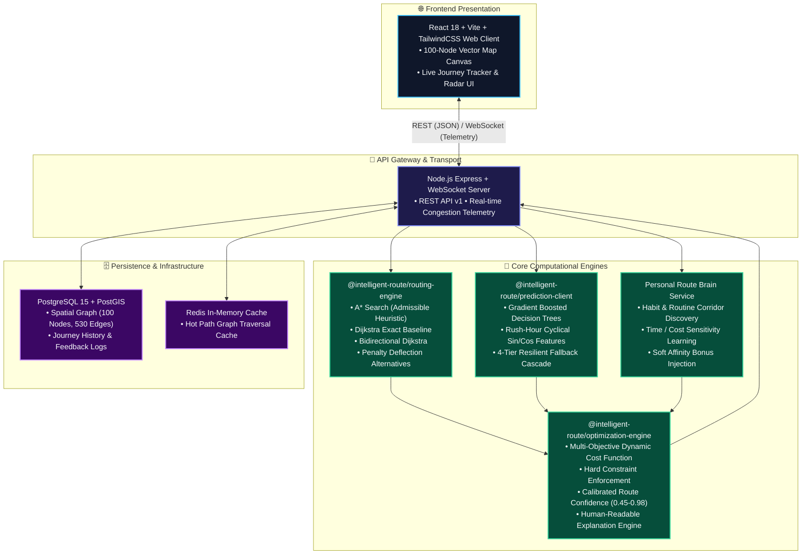
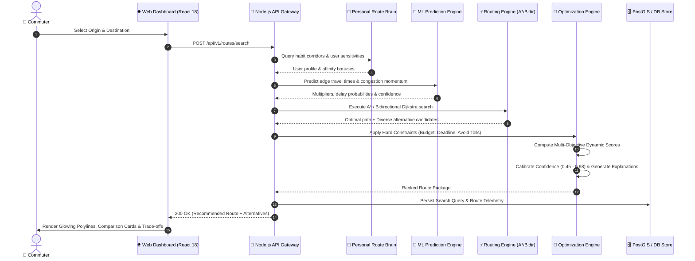

# System Architecture

## 1. High-Level Architecture Overview

As specified in SRS Section 68, the platform is structured around clean modular boundaries where routing, machine learning prediction, personalization, and multi-objective optimization operate as decoupled subsystems:

---

## 2. Component Breakdown

### 2.1 `@intelligent-route/routing-engine`
- **MinPriorityQueue**: High-performance binary min-heap for priority queue operations.
- **RoutingGraph**: Adjacency and reverse adjacency map structure holding nodes and edges.
- **A\* Algorithm**: Uses Euclidean/Haversine admissible heuristic for fast geographic pathfinding.
- **Dijkstra Algorithm**: Exact baseline for correctness validation and comparative benchmarking.
- **Bidirectional Search**: Simultaneous frontier expansion from origin and destination.
- **Alternative Corridor Generator**: Combines profile variation with penalty deflection to discover distinct topological corridors.

### 2.2 `@intelligent-route/optimization-engine`
- **Dynamic Cost Function**:
  $$Score = W_d \cdot \text{Distance} + W_t \cdot \text{TravelTime} + W_c \cdot \text{Cost} + W_p \cdot \text{PredictedDelay} + W_r \cdot \text{Risk} + W_u \cdot \text{UserPrefPenalty}$$
- **Profile Presets**: Normalized weight vectors for `Fastest`, `Cheapest`, `Shortest`, `Balanced`, and `Custom`.
- **Constraint Checker**: Evaluates non-negotiable hard constraints (Max Budget, Max Distance, Arrival Deadline, Forbidden Road Types) prior to ranking.
- **Route Confidence Scorer**: Calibrates route certainty between 0.45 and 0.98 based on traffic volatility, segment reliability, and prediction stability.
- **Explanation Engine**: Generates human-understandable rationale for route selection.

### 2.3 `@intelligent-route/prediction-client`
- **Feature Engineering**: Cyclical time encoding ($\sin / \cos$), rush-hour detection, traffic trend momentum, road capacity.
- **Gradient Boosted Model**: Decision tree ensemble delivering travel time multiplier, delay min, confidence, and delay probability.
- **Historical Baseline**: Time-of-day moving average benchmark.
- **Fallback Cascade**: Gracefully drops to baseline, current observation, or free-flow speed if ML is unavailable.

### 2.4 Personal Route Brain (`personal-brain.service.ts`)
- Continuously aggregates historical journeys.
- Identifies frequent Origin-Destination pairs and preferred corridors.
- Injects soft personalization affinity bonuses into the optimization scoring without violating hard constraints.

---

## 3. Request Flow Diagram

