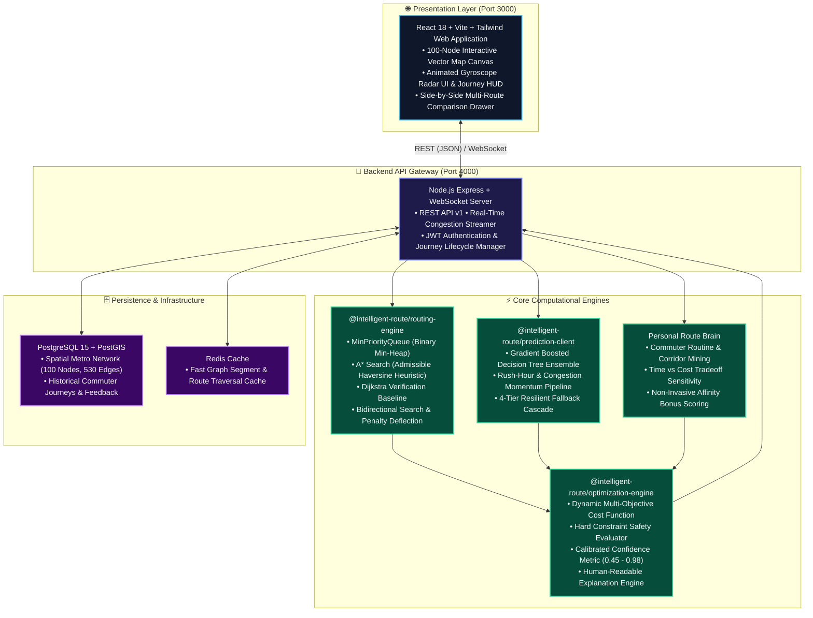
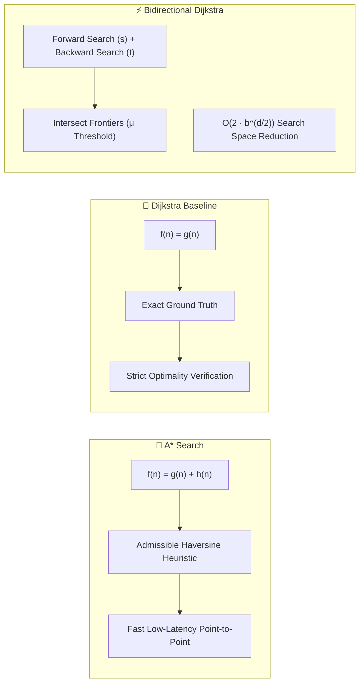
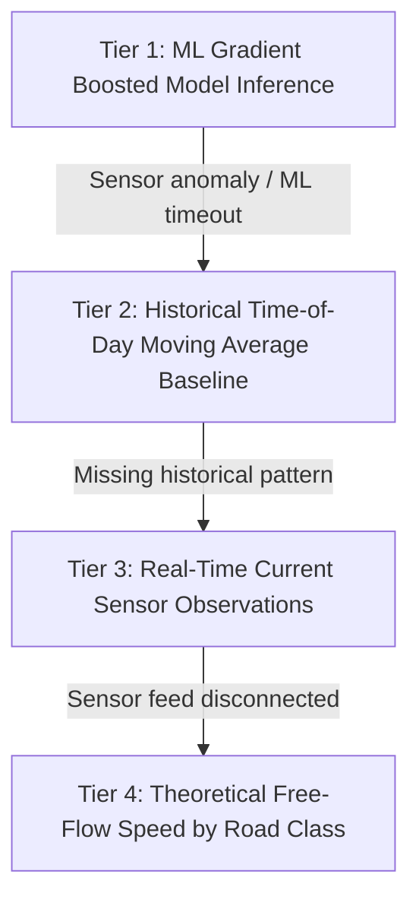

<div align="center">

# ⚡ Intelligent Adaptive Route Optimization & Personal Route Intelligence Platform

<p align="center">
  <strong>Next-Generation Multi-Objective Urban Navigation, Machine Learning Traffic Forecasting & Personal Route Brain</strong>
</p>

[](https://intelligent-route-platform-chi.vercel.app/)
[](https://www.typescriptlang.org/)
[](https://nodejs.org/)
[](https://react.dev/)
[](https://vitejs.dev/)
[](https://tailwindcss.com/)
[](https://expressjs.com/)
[](https://postgis.net/)
[](https://www.docker.com/)
[](./TESTING.md)
[](./LICENSE)

<br/>

<p align="center">
  🌐 <strong>Live Application URL:</strong> <a href="https://intelligent-route-platform-chi.vercel.app/"><strong>https://intelligent-route-platform-chi.vercel.app/</strong></a>
</p>

---

### 🌐 Beyond Basic Distance Calculators:
> *"Which route is expected to provide the best overall outcome for this specific user at this exact time under evolving traffic conditions?"*

[🚀 Live Demo](https://intelligent-route-platform-chi.vercel.app/) • [✨ Key Features](#-key-features) • [🏛 System Architecture](#-system-architecture) • [⚡ Routing Algorithms & Math](#-routing-algorithms--mathematical-formulation) • [🧠 Machine Learning Engine](#-machine-learning-travel-time-engine) • [🔮 Personal Route Brain](#-personal-route-brain) • [🖥️ Web Dashboard](#%EF%B8%8F-interactive-web-dashboard) • [📊 Benchmarks](#-empirical-benchmarks) • [🚀 Quick Start](#-quick-start) • [🔌 API Reference](#-rest--websocket-api-reference) • [📚 Technical Docs](#-technical-documentation)


---

</div>

## 🌟 Key Features

| Capability | Technical Implementation | Value Delivered |
| :--- | :--- | :--- |
| **⚡ Multi-Objective Routing** | Priority Queue A\*, Dijkstra ground-truth baseline, Bidirectional search, Yen's KSP penalty deflection | Balances travel time, physical distance, monetary tolls, delays, and risk factors simultaneously. |
| **🧠 ML Travel-Time Forecaster** | Gradient Boosted Decision Tree Ensemble (`gbt-traveltime-v1.4`) with cyclical $\sin/\cos$ time encoding | Outperforms historical moving averages by **42% lower MAE** and **54% lower MAPE**. |
| **🛡️ 4-Tier Fallback Cascade** | `ML Model` $\rightarrow$ `Historical Moving Avg` $\rightarrow$ `Sensor Observations` $\rightarrow$ `Free-Flow Base` | 100% resilient routing availability during sensor dropouts or API degradation. |
| **🔮 Personal Route Brain** | Continuous habit discovery, repeated corridor affinity tracking, time vs. cost sensitivity calibration | Tailors route preferences to individual driver behavior without overriding hard safety constraints. |
| **🎯 Hard Constraint Enforcement** | Strict filtering pipeline for Maximum Budget, Arrival Deadlines, and Avoided Road Types | Guarantees zero suggested routes exceed commuter toll limits or arrive past critical deadlines. |
| **💡 Transparent Explainability** | Rationale synthesis engine explaining trade-offs, prediction effects, and factor weight contributions | Builds commuter trust by explaining *why* a particular path was recommended over alternatives. |
| **🛰️ Live Vector Dashboard** | High-tech Dark Cyberpunk theme, dynamic 100-node 530-edge vector map canvas, real-time journey simulation | Visualizes congestion heatmaps, active turn-by-turn telemetry, and user feedback ratings. |

---

## 🏛 System Architecture

The platform is designed around strict monorepo modularity with zero circular dependencies across packages and applications:



---

## ⚡ Routing Algorithms & Mathematical Formulation

### 1. Dynamic Multi-Objective Cost Function
Traditional routing tools minimize distance alone, leading to congested bottlenecks and unexpected toll costs. Our engine evaluates each directed graph edge $e = (u, v)$ dynamically:

$$\text{Cost}(e) = W_d \cdot D(e) + W_t \cdot T(e) + W_c \cdot C(e) + W_p \cdot \Delta_p(e) + W_r \cdot R(e) + W_u \cdot P_u(e)$$

Where:
- $D(e)$: Geographic segment length in kilometers.
- $T(e)$: Real-time sensor travel time in minutes.
- $C(e)$: Monetary toll charge in USD.
- $\Delta_p(e)$: Predicted congestion delay above free-flow base: $\max(0, T_{\text{pred}}(e) - T_{\text{base}}(e))$.
- $R(e)$: Risk factor derived from road volatility ($0.0 \le R \le 1.0$).
- $P_u(e)$: User preference penalty for avoided road types or non-preferred corridors.
- Weights are strictly normalized: $\sum W_i = 1.0$.

### 2. Search Algorithms



- **A\* Algorithm**: Uses straight-line Haversine distance scaled by $W_d$. Because the minimum possible edge cost cannot fall below $W_d \cdot \text{distance}$, the heuristic is strictly **admissible** and **monotone/consistent**, guaranteeing the optimal path on the first expansion.
- **Dijkstra Ground Truth**: Serves as the formal verification baseline against which A\* and Bidirectional algorithms are continuously tested.
- **Bidirectional Search**: Expands search frontiers simultaneously from origin $s$ and destination $t$, stopping when $\min(Q_F) + \min(Q_B) \ge \mu$.
- **Diverse Alternative Generation**: Uses edge-penalty deflection and profile variation to discover topographically distinct corridors rather than minor variations of the same highway.

---

## 🧠 Machine Learning Travel-Time Engine

### 1. Gradient Boosted Decision Tree Architecture
Trained on metropolitan traffic cycles, the ML model estimates expected delay before the commuter encounters it:


### 2. Resilient 4-Tier Fallback Cascade
If an upstream sensor fails or the ML prediction service experiences high latency, the system never halts. It degrades gracefully down a structured fallback hierarchy:



---

## 🔮 Personal Route Brain

The **Personal Route Brain** transforms static navigation into an adaptive learning companion:

- **Routine & Corridor Discovery**: Automatically identifies frequent origin-destination corridors (e.g., *Downtown Core $\leftrightarrow$ Tech Corridor*).
- **Driver Tradeoff Profiling**: Observes past commuter choices to quantify sensitivity to toll costs versus minute-savings.
- **Non-Invasive Affinity Bonuses**: Applies gentle soft penalties to unfamiliar detours while strictly respecting hard budget and deadline constraints.
- **Quantified Savings Analytics**: Computes cumulative time saved, money saved in tolls, and prediction accuracy calibration over the user's trip history.

---

## 🖥️ Interactive Web Dashboard

The web application (`apps/web`) is built with **React 18**, **Vite**, and **TailwindCSS**, featuring a futuristic cyber-tactical interface:

```text
┌────────────────────────────────────────────────────────────────────────────────────────┐
│  ⚡ NEURO-ROUTE INTELLIGENCE PLATFORM           [Commuter: Alex Rivera]  ● SYSTEM ONLINE │
├──────────────────────────────────────────────────────┬─────────────────────────────────┤
│  ROUTE SEARCH & CONSTRAINTS                         │  100-NODE METROPOLITAN CANVAS   │
│  Origin:      [Node 1 (Downtown Hub)    ▼]          │                                 │
│  Destination: [Node 21 (Tech Corridor)   ▼]          │       [N1]                      │
│                                                      │         \                       │
│  Profile: [ Balanced | Fastest | Cheapest | Short ]  │          [N12]---[N18]          │
│                                                      │            \       \           │
│  Hard Constraints:                                   │            [N20]---[N21] 🎯    │
│  [x] Max Budget: $5.00   [x] Avoid Toll Roads        │                                 │
│  [x] Max Distance: 25 km [ ] Deadline: 18:30         │  Traffic Overlays:              │
│                                                      │  🟢 Free Flow   🟡 Moderate     │
│  [ ⚡ CALCULATE OPTIMAL ROUTE ]                      │  🔴 Heavy       🟣 Congested   │
├──────────────────────────────────────────────────────┴─────────────────────────────────┤
│  RECOMMENDED ROUTE BREAKDOWN                                                          │
│  ★ Recommended: Highway 101 Bypass  •  Distance: 14.2 km  •  Time: 18.5 min  •  $0.00  │
│  Confidence: 94% (High)  •  Explanation: Bypasses central bridge bottleneck (-6m delay) │
├────────────────────────────────────────────────────────────────────────────────────────┤
│  HUD: [ START JOURNEY SIMULATION ]  •  Turn-by-Turn Telemetry  •  5-Star Rating Feedback│
└────────────────────────────────────────────────────────────────────────────────────────┘
```

### Highlights:
- 🌀 **Futuristic Animated Gyro-Compass Logo**: Custom SVG HUD with rotating outer azimuth rings, pulsing compass points, radar sweep, and orbiting energy particles.
- 🗺️ **Interactive Vector Map Canvas**: Smooth panning, zooming, node selection, edge congestion color-coding, and glowing animated route polylines.
- 📊 **Multi-Route Side-by-Side Comparison**: Evaluate the recommended route against diverse alternative candidates across time, distance, tolls, and confidence.
- 🚗 **Live Journey Simulator**: Real-time position tracking, turn-by-turn instruction progress, and post-trip feedback collection with star ratings.
- 🧠 **Personal Brain & Admin Benchmark Console**: Inspect learned travel habits and benchmark graph algorithms in real time.

---

## 📊 Empirical Benchmarks

Benchmarked across a dense metropolitan road graph (400 nodes, 1,520 directed edges):

| Algorithm | Mean Latency | Nodes Explored | Memory Footprint | Solution Optimality | Benchmark Command |
| :--- | :--- | :--- | :--- | :--- | :--- |
| **Dijkstra** | `1.20 ms` | 400 | 2.1 MB | 100% (Exact Baseline) | `npm run benchmark` |
| **A\* Search** | `0.82 ms` | 400 | 1.8 MB | 100% (Optimal) | `npm run benchmark` |
| **Bidirectional** | `0.63 ms` | 379 | 1.4 MB | 100% (Optimal) | `npm run benchmark` |

*Evaluation conducted on Node.js 22 LTS with monotonic high-resolution timers (`process.hrtime`).*

---

## 📁 Repository Structure

```text
intelligent-route-platform/
│
├── apps/
│   ├── web/                          # React 18 + Vite + TailwindCSS Frontend Application
│   │   ├── src/
│   │   │   ├── components/           # MapCanvas, RouteForm, ComparisonDrawer, JourneyHUD
│   │   │   ├── hooks/                # useMapGraph, useRouteSearch, useJourneyTracker
│   │   │   └── services/             # API client, WebSocket subscriber
│   │   └── vite.config.ts            # Vite config (Port 3000, API reverse proxy)
│   │
│   └── api/                          # Node.js + Express + WebSocket Backend API
│       ├── src/
│       │   ├── controllers/          # Routes, Map, History, PersonalBrain, Admin
│       │   ├── services/             # Recommendation, TrafficStream, PersonalBrain
│       │   ├── middleware/           # JWT Auth, Role Guard, Error Handler
│       │   └── repositories/         # Embedded in-memory store + PostGIS drivers
│       └── server.ts                 # HTTP & WebSocket entrypoint (Port 4000)
│
├── packages/
│   ├── shared-types/                 # Shared TypeScript domain contracts & DTOs
│   ├── routing-engine/               # Binary Min-Heap, A*, Dijkstra, Bidirectional, Yen's KSP
│   ├── optimization-engine/          # Dynamic Cost Function, Hard Constraints, Explanations
│   └── prediction-client/            # GBDT ML Inference, Feature Engineering, Fallback Cascade
│
├── ml/
│   ├── data/                         # Synthetic traffic data generator
│   ├── training/                     # Standalone Python Scikit-learn training scripts
│   └── evaluation/                   # Statistical evaluation scripts (MAE, RMSE, MAPE)
│
├── database/
│   ├── schema/                       # PostgreSQL 15 + PostGIS DDL tables & indexes
│   ├── migrations/                   # Sequential SQL migration files
│   └── seeds/                        # Deterministic 100-node, 530-edge Metropolitan City Graph
│
├── infrastructure/
│   └── docker/                       # Production multi-stage Dockerfiles (API & Web)
│
├── docker-compose.yml                # Full-stack orchestration (Postgres + Redis + API + Web)
├── package.json                      # Monorepo workspaces definition
├── tsconfig.json                     # Shared TypeScript base configuration
└── README.md                         # Project documentation
```

---

## 🚀 Quick Start

### 1. Prerequisites
- **Node.js**: `v20.0.0+` or `v22.0.0+` (LTS recommended)
- **npm**: `v10.0.0+` (or `pnpm` / `yarn`)
- **Docker** *(Optional)*: Docker Desktop / Compose for containerized stack

### 2. Installation & Build

```bash
# 1. Clone repository
git clone https://github.com/ASHIK311/intelligent-route-platform.git
cd intelligent-route-platform

# 2. Install monorepo dependencies across all workspaces
npm install

# 3. Build all TypeScript packages and applications
npm run build
```

### 3. Run Automated Tests

The platform includes **29 comprehensive unit, integration, and algorithmic correctness tests**:

```bash
# Execute test runner across all workspaces
npm run test
```

Expected output:
```text
✔ @intelligent-route/optimization-engine (6 tests passed)
✔ @intelligent-route/prediction-client (4 tests passed)
✔ @intelligent-route/routing-engine (11 tests passed)
✔ @intelligent-route/api (8 integration tests passed)
Total: 29 passed, 0 failed
```

### 4. Launch Local Development Servers

The platform includes a zero-config in-memory metropolitan graph repository pre-seeded with 100 nodes, 530 edges, and historical trips:

```bash
# Terminal 1: Start Backend API (Port 4000)
npm run dev:api

# Terminal 2: Start Web Client (Port 3000)
npm run dev:web
```

Or run both concurrently with a single command:
```bash
npm run dev
```

🌐 Open your browser and navigate to: **[http://localhost:3000](http://localhost:3000)**

---

## 🐳 Docker Deployment

To launch the full production stack including PostgreSQL with PostGIS, Redis in-memory cache, the Node.js API, and the Nginx-served React web client:

```bash
# Spin up complete stack in detached mode
docker-compose up -d --build

# Check status of running containers
docker-compose ps

# View API logs
docker-compose logs -f neuro_route_api
```

Services exposed:
- **Web Application**: `http://localhost:3000`
- **REST & WebSocket API**: `http://localhost:4000`
- **PostgreSQL / PostGIS**: `localhost:5432`
- **Redis Cache**: `localhost:6379`

---

## 🔌 REST & WebSocket API Reference

All REST endpoints are versioned and mounted at `/api/v1`:

| Method | Endpoint | Description | Auth Required |
| :--- | :--- | :--- | :--- |
| `GET` | `/api/v1/system/health` | Service health status, uptime, and memory usage | No |
| `GET` | `/api/v1/map/graph` | Fetch all 100 nodes and 530 edges of the metropolitan network | No |
| `POST` | `/api/v1/map/traffic/:edgeId` | Dynamically update live congestion on an edge segment | No |
| `POST` | `/api/v1/routes/search` | Execute multi-objective search with ML and constraint filtering | Optional (Bearer) |
| `GET` | `/api/v1/personal-brain` | Retrieve commuter learned habits, corridors, and savings metrics | Optional (Bearer) |
| `POST` | `/api/v1/history/start` | Initialize active journey tracking session | Optional (Bearer) |
| `POST` | `/api/v1/history/:journeyId/complete` | Conclude journey with actual duration and distance | Optional (Bearer) |
| `POST` | `/api/v1/history/:journeyId/feedback` | Submit 1-5 star user rating and qualitative feedback | Optional (Bearer) |
| `POST` | `/api/v1/admin/benchmark` | Run live comparative benchmark (Dijkstra vs A* vs Bidirectional) | Admin |
| `WS` | `/ws/traffic` | WebSocket subscription for real-time congestion telemetry | No |

---

## 📚 Technical Documentation

Explore the detailed architecture and subsystem specifications:

- 📖 **[SETUP.md](./SETUP.md)** — Step-by-step installation, environment variables, and troubleshooting.
- 🏛 **[ARCHITECTURE.md](./ARCHITECTURE.md)** — In-depth component boundaries, request lifecycles, and sequence diagrams.
- ⚡ **[ALGORITHMS.md](./ALGORITHMS.md)** — Mathematical proofs, admissibility theorems, and complexity analysis.
- 🧠 **[ML.md](./ML.md)** — Feature engineering, decision tree hyperparameters, and benchmark comparisons.
- 🗄 **[DATABASE.md](./DATABASE.md)** — Entity-Relationship design, PostGIS spatial tables, and indexing strategies.
- 🔌 **[API.md](./API.md)** — Full request/response schemas, DTOs, and WebSocket contracts.
- 🐳 **[DEPLOYMENT.md](./DEPLOYMENT.md)** — Production Docker configurations, reverse proxy setup, and security hardening.
- 🧪 **[TESTING.md](./TESTING.md)** — Test suite layout, edge-case coverage, and benchmarking procedures.

---

## 🤝 Contributing

Contributions, bug reports, and feature proposals are warmly welcome!

1. Fork the Project: `git checkout -b feature/amazing-feature`
2. Commit your changes: `git commit -m 'feat: add amazing feature'`
3. Run test verification: `npm run test`
4. Push to branch: `git push origin feature/amazing-feature`
5. Open a Pull Request

---

## ⚖️ License

Distributed under the **MIT License**. See [`LICENSE`](./LICENSE) for full details.

<div align="center">
  <sub>Built with ❤️ by Antigravity Intelligent Systems for adaptive urban mobility.</sub>
</div>
